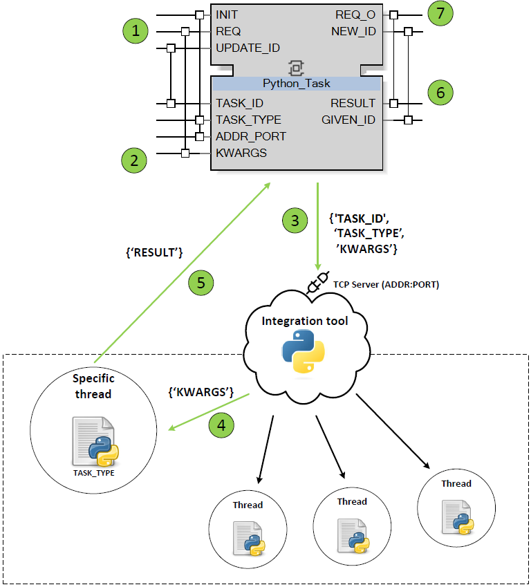
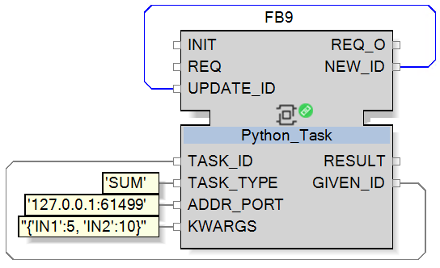

# python61499

This is a Python tool (licensed under Apache 2.0) to integrate high-level code with IEC 61499 standard, specifically with ***EchoStruxure Automation Expert*** (Schneider Electric).

The tool is developed by [SUPPRESS Research Group](https://suppress.unileon.es/en/), from [Universidad de León](https://www.unileon.es/), and it's also available in our [GitHub site](https://github.com/suppress-unileon/python61499/tree/main).

## How it works



The tool integrates Python code with Function Blocks (FBs) as follows:

1. A ***REQ*** event reaches an instance of the Function Block ***Python_Task***
2. ***KWARGS*** string is updated in the Function Block ***Python_Task***
3. The Function Block ***Python_Task*** is executed and a dictionary containing ***KWARGS*** ,***TASK_TYPE*** and ***TASK_ID*** is sent to the Python code.
4. A TCP Server listening on ***ADDR_PORT*** catches the dictionary and handles the request.
5. Once the Python code finishes, the result is sent back to the Function Block ***Python_Task***.
6. The output ***RESULT*** is updated in the Function Block ***Python_Task***.
7. The ***REQ_O*** event is triggered in the Function Block ***Python_Task***.

In order to avoid race conditions, every ***Python_Task*** instance has a unique ***TASK_ID***. This ID is assigned automatically by the tool, when the ***INIT*** event is triggered.
User only needs to connect ***NEW_ID*** to ***UPDATE_ID*** and ***GIVEN_ID*** to ***TASK_ID***, in order to configure the ***Python_Task*** instance.

With this Function Block, ***RESULT*** can only be a number (real). Another Function Block called ***Python_Task_JSON*** is also available. With this Function Block, users can configure Python tasks that return dictionaries, bringing much more flexibility.

## QuickStart

Once you have cloned the repository, you can run the following command to launch the tool:
```cmd
cd python_tool/
python main.py
```
The tool comes with a toy task configured in ```python_tool/resoruces/available_tasks/SUM.py```:
```python
class SUM:
    def execute(self, IN1=None, IN2=None):
        return IN1+IN2
```
This task could be tested with the following Function Block:



Users can implement their own tasks by creating a new Python file ```python_tool/resoruces/available_tasks/TASK_NAME.py``` containing a class ```TASK_NAME``` with an ```execute``` method. The method should return a number (real) or a JSON.

#### TroubleShooting
In order to make debugging easier, the tool comes with a logger. The logger is configured to write logs in ```python_tool/resources/error_list.log```. This log file is restarted every time the tool is launched.

## Repository structure
The repository contains the following folders:
 - ```python_tool/```: Contains the aforementioned tool.
 - ```EAE_function_block/```: Contains importable libraries for EchoStruxure Automation Expert.
    - ```SUPPRESS.python61499```: Contains the Function Blocks ***Python_Task*** and ***Python_Task_JSON***, as well as some auxiliary Function Blocks.
    - ```SUPPRESS.EventBasedPID```: Contains Function Blocks in order to implement an Event-Based PID controller. This is the implmenentation proposed by [Karl-Erik Åarzén](https://doi.org/10.1016/S1474-6670(17)57482-0).

# Cite
If you think this tool is useful for your research, please consider citing it:
```bibtex
@article{GonzlezMateos2024,
  title = {A PID Control Architecture Based on IEC 61499},
  volume = {58},
  ISSN = {2405-8963},
  url = {http://dx.doi.org/10.1016/j.ifacol.2024.08.016},
  DOI = {10.1016/j.ifacol.2024.08.016},
  number = {7},
  journal = {IFAC-PapersOnLine},
  publisher = {Elsevier BV},
  author = {González-Mateos,  Guzmán and Prada,  Miguel A. and Morán,  Antonio and González-Herbón,  Raúl and Domínguez,  Manuel},
  year = {2024},
  pages = {91–96}
}
```